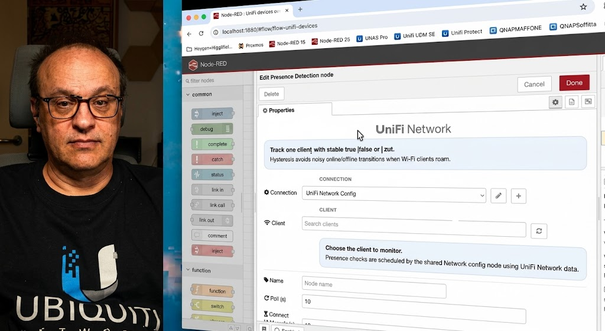

  

[![NPM version][npm-version-image]][npm-url]
[![Node.js version][node-version-image]][npm-url]
[![Node-RED Flow Library][flows-image]][flows-url]
[![Docs][docs-image]][docs-url]
[![NPM downloads per month][npm-downloads-month-image]][npm-url]
[![NPM downloads total][npm-downloads-total-image]][npm-url]
[![MIT License][license-image]][license-url]
[![Youtube][youtube-image]][youtube-url]

# node-red-contrib-unifi-ultimate

Control and monitor your **UniFi Network**, **UniFi Protect**, and **UniFi Access** devices directly from Node-RED — no technical knowledge required.

[View Changelog](CHANGELOG.md)

<a href="https://www.youtube.com/playlist?list=PL9Yh1bjbLAYrWKtMlopN0swuQXbdJ8MFJ">
  
  Watch news and tutorials on YouTube
   
   
  

    
  

</a>

 
 

## Install

In Node-RED:

1. Open `Manage palette`.
2. Select `Install`.
3. Search for `node-red-contrib-unifi-ultimate`.
4. Install the package.

## Quick Start

1. Add a config node for your UniFi product: **Unifi Network Config**, **Unifi Protect Config**, or **Unifi Access Config**.
2. Enter your UniFi controller address and login credentials.
3. Add the matching node to your flow.
4. Select the device you want to control or monitor.
5. Select the action.
6. Click **Deploy**.
7. Send any message into the node to run the action.

> **Tip:** For most actions, the incoming message is just a trigger — the node uses the device and action you configured in the editor.  
> The only exception is **Control POE** with the *POE controlled by incoming message* action: send `true` to turn PoE on and `false` to turn it off.

> **Custom port:** Each config node has an optional **Port** field. Leave it empty to use the default (`443` for Network/Protect, `12445` for Access). Set it when your controller listens on a custom port — for example a **UniFi OS server** that uses `11443`. A port written directly in the controller address (`host:port`) takes precedence over this field.

> **Self-signed certificates:** Each config node has an **Allow self-signed certificate** option, enabled by default. UniFi controllers almost always present a self-signed certificate, so keep it checked for UniFi OS / UXG setups. Uncheck it only if your controller uses a certificate signed by a trusted certificate authority and you want strict verification.

 
 

  

Use **Network** nodes to work with:

- sites
- UniFi devices such as switches and access points
- connected clients such as phones, computers, and IoT devices
- switch ports and PoE control
- client presence detection

Things you can do:

- Check whether a device or phone is connected to your network.
- Count how many clients are currently online.
- Create guest Wi-Fi vouchers.
- Read CPU usage, memory, and uptime from a switch or access point.
- Read the temperature of a switch (where supported).
- Restart a UniFi device.
- Power-cycle or turn on/off a PoE port.
- Let the PoE node automatically find which port a client is connected to.

 
 

  

Use **Protect** nodes to work with:

- cameras
- sensors (motion, contact, temperature, humidity, leak)
- lights
- chimes
- viewers
- NVR

Things you can do:

- Receive motion, ring, contact, tamper, leak, and low-battery alerts.
- Read the current state of a camera or sensor.
- Take a camera snapshot.
- Control PTZ cameras (move to preset, start/stop patrol).
- Display a custom message on a doorbell screen.
- Switch a viewer to a different live feed.

 
 

  

Use **Access** nodes to work with:

- doors
- Access devices (hubs, intercoms)
- door events (unlock, ring, DPS, emergency)
- lock rules and schedules
- doorbell actions

Things you can do:

- Unlock a door remotely.
- Set a temporary unlock window with a custom duration.
- Enable lockdown or evacuation mode.
- Receive door events in real time.
- Trigger or cancel an intercom doorbell.

## Outputs

Every node has **two outputs**:

| Output | When it fires |
| ------ | ------------- |
| **1 — result** | The action completed successfully. The result is available in `msg.payload`. |
| **2 — error** | Something went wrong (connection problem, timeout, unsupported action). |

When an error occurs, the node status turns red and the error message comes out of the second output. Connect it to a **debug** node to see what happened, or wire it to any notification logic in your flow.

**Repeat periodically** — for read actions, you can tick *Emit periodically* in the node editor to have the node send the result automatically at a fixed interval, without needing an Inject node.

## Example Flows

Import from `examples/`:

| Flow file | What it demonstrates |
| --------- | -------------------- |
| [examples/unifi-protect-info.json](examples/unifi-protect-info.json) | Read the state of a Protect camera |
| [examples/unifi-protect-sensor-observe.json](examples/unifi-protect-sensor-observe.json) | Receive sensor events (motion, temperature, humidity, …) |
| [examples/unifi-protect-camera-actions.json](examples/unifi-protect-camera-actions.json) | Take snapshots, move PTZ, show doorbell messages |
| [examples/unifi-access-door-control.json](examples/unifi-access-door-control.json) | Door state, remote unlock, temporary lock rule |
| [examples/unifi-access-intercom-doorbell.json](examples/unifi-access-intercom-doorbell.json) | Intercom — receive ring, trigger and cancel doorbell |

## Notes

- You need valid login credentials for the UniFi application you want to use.
- Some actions are only available on specific device models.
- UniFi behavior can vary between application versions.

[npm-version-image]: https://img.shields.io/npm/v/node-red-contrib-unifi-ultimate.svg
[npm-url]: https://www.npmjs.com/package/node-red-contrib-unifi-ultimate
[node-version-image]: https://img.shields.io/node/v/node-red-contrib-unifi-ultimate.svg
[flows-image]: https://img.shields.io/badge/Node--RED-Flow%20Library-red
[flows-url]: https://flows.nodered.org/node/node-red-contrib-unifi-ultimate
[docs-image]: https://img.shields.io/badge/docs-documents-blue
[docs-url]: https://github.com/Supergiovane/node-red-contrib-unifi-ultimate#readme
[npm-downloads-month-image]: https://img.shields.io/npm/dm/node-red-contrib-unifi-ultimate.svg
[npm-downloads-total-image]: https://img.shields.io/npm/dt/node-red-contrib-unifi-ultimate.svg
[license-image]: https://img.shields.io/badge/license-MIT-green.svg
[license-url]: https://opensource.org/licenses/MIT
[youtube-image]: https://img.shields.io/badge/YouTube-Subscribe-red?logo=youtube&logoColor=white
[youtube-url]: https://www.youtube.com/watch?v=ZOq7M5mgUBk&list=PL9Yh1bjbLAYrWKtMlopN0swuQXbdJ8MFJ
