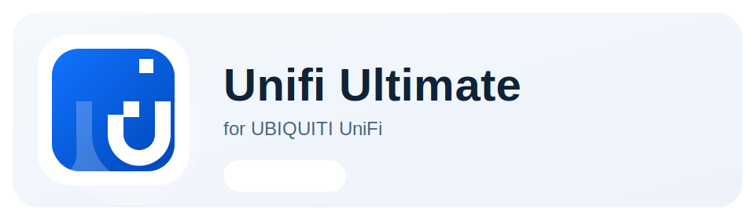

<p align="center">
  
</p>

[![NPM version][npm-version-image]][npm-url]
[![Node.js version][node-version-image]][npm-url]
[![Node-RED Flow Library][flows-image]][flows-url]
[![Docs][docs-image]][docs-url]
[![NPM downloads per month][npm-downloads-month-image]][npm-url]
[![NPM downloads total][npm-downloads-total-image]][npm-url]
[![MIT License][license-image]][license-url]
[![Youtube][youtube-image]][youtube-url]

# node-red-contrib-unifi-ultimate

Control and monitor `UniFi Network`, `UniFi Protect`, and `UniFi Access` from Node-RED without building API requests by hand.

> **Beta notice:** until version `1.0.0`, this package should be considered **BETA** and may include **breaking changes** between releases.  
> Please [report issues or feedback](https://github.com/Supergiovane/node-red-contrib-unifi-ultimate/issues) to help improve the package.

[View Changelog](CHANGELOG.md)

<a href="https://www.youtube.com/watch?v=ZOq7M5mgUBk&list=PL9Yh1bjbLAYrWKtMlopN0swuQXbdJ8MFJ">
  
  Watch news and tutorials on YouTube
</a>

## Install

In Node-RED:

1. Open `Manage palette`.
2. Select `Install`.
3. Search for `node-red-contrib-unifi-ultimate`.
4. Install the package.

## Quick Start

1. Add the config node for your UniFi application: `Unifi Network Config`, `Unifi Protect Config`, or `Unifi Access Config`.
2. Enter the UniFi host/IP and API credentials.
3. Add the matching device or utility node.
4. Select the item to control or monitor.
5. Select the action.
6. Deploy.
7. Send any message into the node to run the configured action.

For most actions, the incoming message is only a trigger and the node uses the item/action configured in the editor.  
Exception: in `Unifi Network Control POE`, action `POE controlled by msg.payload` uses `msg.payload` (`true` = enable PoE, `false` = disable PoE).

<br/>
<br/>
<p align="left">
  <a href="https://ui.com/switching">
    
  </a>
</p>

Use Network nodes to work with:

- sites
- UniFi devices such as switches and access points
- clients such as phones, computers, and IoT devices
- switch ports
- PoE control
- client presence

Common uses:

- Check whether a client is online.
- Restart a UniFi device.
- Power-cycle a PoE port.
- Turn PoE on or off for a selected switch port.
- Select a client and let the PoE node find the connected switch and port when the information is available.

Editor conveniences:

- Device and client fields are searchable.
- Port lists show port status and connected clients when UniFi exposes that information.
- Selecting an item updates the node `Name` automatically.

<br/>
<br/>
<p align="left">
  <a href="https://store.ui.com/us/en/products/uvc-g5-pro">
    
  </a>
</p>

Use Protect nodes to work with:

- cameras
- sensors
- lights
- chimes
- viewers
- live views
- NVR information

Common uses:

- Receive motion, ring, contact, tamper, leak, and battery events.
- Read the current state of a camera or sensor.
- Take camera snapshots.
- Control PTZ cameras.
- Show doorbell messages.
- Switch viewer live views.
- Update supported device properties.

For supported observables, the node can output simple `true/false` values while still keeping the raw UniFi event details available.

<br/>
<br/>
<p align="left">
  <a href="https://ui.com/door-access">
    
  </a>
</p>

Use Access nodes to work with:

- doors
- Access devices
- door events
- lock rules
- emergency mode
- doorbell actions

Common uses:

- Unlock a door.
- Read or set a temporary lock rule.
- Enable lockdown or evacuation mode.
- Receive Access events.
- Trigger or cancel an intercom doorbell action.

## Outputs

Most nodes send the result on output 1.

Protect and Access device nodes emit both state and live event messages on the same output pin when `Receive Events` is selected.

Useful metadata is attached to the output message, for example:

- `msg.topic` (node `Name` from the editor)
- `msg.deviceName` (remembered/observed client or device name)
- `msg.eventName` (event/trigger that produced the output message)
- `msg.details.unifiNetwork`
- `msg.details.unifiNetworkPresence`
- `msg.details.unifiNetworkPoe`
- `msg.details.unifiProtect`
- `msg.details.unifiAccess`

When `msg.payload` is an object, it also includes `payload.deviceName` with the same value.

## Output Examples

### Unifi Network Device

```json
{
  "topic": "Switch Soffitta",
  "deviceName": "Soffitta",
  "eventName": "request:readState",
  "payload": {
    "id": "8c072de0-d71d-37bd-a6f5-eac67c95a314",
    "name": "Soffitta",
    "state": "READY",
    "deviceName": "Soffitta"
  },
  "details": {
    "unifiNetwork": {
      "nodeType": "device",
      "deviceType": "device",
      "capability": "readState",
      "source": "request"
    }
  }
}
```

### Unifi Network Presence

```json
{
  "topic": "iPhone Massimo Presence",
  "deviceName": "iPhone-Massimo",
  "eventName": "connected",
  "payload": true,
  "present": true,
  "details": {
    "unifiNetworkPresence": {
      "nodeType": "presence",
      "source": "poll",
      "reason": "connected"
    }
  }
}
```

### Unifi Network Control POE

```json
{
  "topic": "POE Soffitta Port 2",
  "deviceName": "Soffitta",
  "eventName": "request:enable",
  "payload": {
    "status": "ok",
    "deviceName": "Soffitta",
    "portIdx": 2,
    "portName": "Port 2",
    "portPowerW": 2.6,
    "powerConsumptionSwitchTotal": 36.4
  },
  "details": {
    "unifiNetworkPoe": {
      "nodeType": "poe-control",
      "action": "enable",
      "portIdx": 2,
      "portPowerW": 2.6,
      "powerConsumptionSwitchTotal": 36.4
    }
  }
}
```

Power fields for `Unifi Network Control POE`:

| Field                                                     | Type   | Guaranteed | Notes                                                                    |
| --------------------------------------------------------- | ------ | ---------- | ------------------------------------------------------------------------ |
| `msg.payload.portIdx`                                     | number | yes        | Selected port index.                                                     |
| `msg.payload.portName`                                    | string | yes        | Selected port display name.                                              |
| `msg.payload.portPowerW`                                  | number | no         | Current PoE power draw for the selected port (W), when UniFi exposes it. |
| `msg.payload.powerConsumptionSwitchTotal`                 | number | no         | Sum of all port PoE consumptions on the switch (W), when available.      |
| `msg.details.unifiNetworkPoe.portPowerW`                  | number | no         | Same value as `msg.payload.portPowerW`.                                  |
| `msg.details.unifiNetworkPoe.powerConsumptionSwitchTotal` | number | no         | Same value as `msg.payload.powerConsumptionSwitchTotal`.                 |

### Unifi Protect Device

```json
{
  "topic": "Front Door Camera",
  "deviceName": "Front Door Camera",
  "eventName": "smartDetectZone",
  "payload": {
    "device": {
      "id": "camera-id"
    },
    "event": {
      "type": "smartDetectZone"
    },
    "deviceName": "Front Door Camera"
  },
  "details": {
    "unifiProtect": {
      "nodeType": "device",
      "deviceType": "camera",
      "capability": "observe",
      "source": "events"
    }
  }
}
```

### Unifi Access Device

```json
{
  "topic": "Main Door",
  "deviceName": "Main Door",
  "eventName": "door.unlock",
  "payload": {
    "event": "door.unlock",
    "deviceName": "Main Door"
  },
  "details": {
    "unifiAccess": {
      "nodeType": "device",
      "deviceType": "door",
      "capability": "observe",
      "source": "events"
    }
  }
}
```

## Example Flows

Import from `examples/`:

| Flow file                                                                                    | What it demonstrates                           |
| -------------------------------------------------------------------------------------------- | ---------------------------------------------- |
| [examples/unifi-protect-info.json](examples/unifi-protect-info.json)                         | Read Protect camera state                      |
| [examples/unifi-protect-sensor-observe.json](examples/unifi-protect-sensor-observe.json)     | Receive boolean sensor events                  |
| [examples/unifi-protect-camera-actions.json](examples/unifi-protect-camera-actions.json)     | Snapshot, PTZ presets, and doorbell messages   |
| [examples/unifi-access-door-control.json](examples/unifi-access-door-control.json)           | Door state, unlock, and temporary lock rule    |
| [examples/unifi-access-intercom-doorbell.json](examples/unifi-access-intercom-doorbell.json) | Intercom observe, trigger, and cancel doorbell |

## Notes

- You need valid API credentials for the UniFi application you want to use.
- Some actions depend on what the selected UniFi device supports.
- UniFi API behavior can vary between application versions.
- For safety, actions exposed by the nodes are intentionally limited to known supported operations.

[npm-version-image]: https://img.shields.io/npm/v/node-red-contrib-unifi-ultimate.svg
[npm-url]: https://www.npmjs.com/package/node-red-contrib-unifi-ultimate
[node-version-image]: https://img.shields.io/node/v/node-red-contrib-unifi-ultimate.svg
[flows-image]: https://img.shields.io/badge/Node--RED-Flow%20Library-red
[flows-url]: https://flows.nodered.org/node/node-red-contrib-unifi-ultimate
[docs-image]: https://img.shields.io/badge/docs-documents-blue
[docs-url]: https://github.com/Supergiovane/node-red-contrib-unifi-ultimate#readme
[npm-downloads-month-image]: https://img.shields.io/npm/dm/node-red-contrib-unifi-ultimate.svg
[npm-downloads-total-image]: https://img.shields.io/npm/dt/node-red-contrib-unifi-ultimate.svg
[license-image]: https://img.shields.io/badge/license-MIT-green.svg
[license-url]: https://opensource.org/licenses/MIT
[youtube-image]: https://img.shields.io/badge/YouTube-Subscribe-red?logo=youtube&logoColor=white
[youtube-url]: https://www.youtube.com/watch?v=ZOq7M5mgUBk&list=PL9Yh1bjbLAYrWKtMlopN0swuQXbdJ8MFJ
