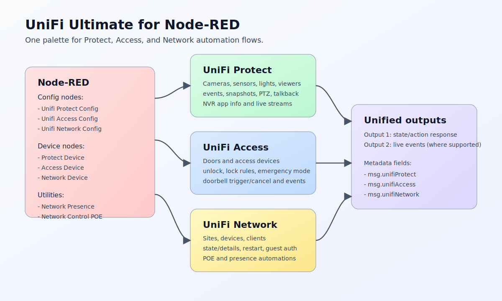

  

  

[![NPM version][npm-version-image]][npm-url]
[![Node.js version][node-version-image]][npm-url]
[![Node-RED Flow Library][flows-image]][flows-url]
[![Docs][docs-image]][docs-url]
[![NPM downloads per month][npm-downloads-month-image]][npm-url]
[![NPM downloads total][npm-downloads-total-image]][npm-url]
[![MIT License][license-image]][license-url]
[![Youtube][youtube-image]][youtube-url]

# node-red-contrib-unifi-ultimate

Control and monitor `UniFi Network`, `UniFi Protect`, and `UniFi Access` from Node-RED without building API requests by hand.

[View Changelog](CHANGELOG.md)

## Why Use It

- Manage UniFi cameras, sensors, doors, clients, switches, and PoE ports from Node-RED.
- Pick devices and clients from searchable lists instead of copying IDs manually.
- Trigger configured actions with any incoming message.
- Receive live events from Protect and Access.
- Build presence, door, camera, and PoE automations with less custom code.
- Use one package for the main UniFi applications.

## Install

In Node-RED:

1. Open `Manage palette`.
2. Select `Install`.
3. Search for `node-red-contrib-unifi-ultimate`.
4. Install the package.

## Quick Start

1. Add the config node for your UniFi application: `Unifi Network Config`, `Unifi Protect Config`, or `Unifi Access Config`.
2. Enter the UniFi host/IP and API credentials.
3. Add the matching device or utility node.
4. Select the item to control or monitor.
5. Select the action.
6. Deploy.
7. Send any message into the node to run the configured action.

The incoming message is only a trigger. The node uses the item and action configured in the editor.

## Available Nodes

| Node | What it does |
|---|---|
| `Unifi Network Config` | Connection settings for UniFi Network |
| `Unifi Network Device` | Read sites, devices, clients, and run supported Network actions |
| `Unifi Network Presence` | Track whether a selected client is present |
| `Unifi Network Control POE` | Enable, disable, or power-cycle PoE on a switch port |
| `Unifi Protect Config` | Connection settings for UniFi Protect |
| `Unifi Protect Device` | Read cameras/sensors/devices, receive events, and run Protect actions |
| `Unifi Access Config` | Connection settings for UniFi Access |
| `Unifi Access Device` | Read doors/devices, receive events, and run Access actions |

## UniFi Network

  

Use Network nodes to work with:

- sites
- UniFi devices such as switches and access points
- clients such as phones, computers, and IoT devices
- switch ports
- PoE control
- client presence

Common uses:

- Check whether a client is online.
- Restart a UniFi device.
- Power-cycle a PoE port.
- Turn PoE on or off for a selected switch port.
- Select a client and let the PoE node find the connected switch and port when the information is available.

Editor conveniences:

- Device and client fields are searchable.
- Port lists show port status and connected clients when UniFi exposes that information.
- Selecting an item updates the node `Name` automatically.

## UniFi Protect

  

Use Protect nodes to work with:

- cameras
- sensors
- lights
- chimes
- viewers
- live views
- NVR information

Common uses:

- Receive motion, ring, contact, tamper, leak, and battery events.
- Read the current state of a camera or sensor.
- Take camera snapshots.
- Control PTZ cameras.
- Show doorbell messages.
- Switch viewer live views.
- Update supported device properties.

For supported observables, the node can output simple `true/false` values while still keeping the raw UniFi event details available.

## UniFi Access

  

Use Access nodes to work with:

- doors
- Access devices
- door events
- lock rules
- emergency mode
- doorbell actions

Common uses:

- Unlock a door.
- Read or set a temporary lock rule.
- Enable lockdown or evacuation mode.
- Receive Access events.
- Trigger or cancel an intercom doorbell action.

## Outputs

Most nodes send the result on output 1.

Protect and Access device nodes can also send live events on output 2 when `Receive Events` is selected.

Useful metadata is attached to the output message, for example:

- `msg.unifiNetwork`
- `msg.unifiNetworkPresence`
- `msg.unifiNetworkPoe`
- `msg.unifiProtect`
- `msg.unifiAccess`

## Example Flows

Import from `examples/`:

| Flow file | What it demonstrates |
|---|---|
| [examples/unifi-protect-info.json](examples/unifi-protect-info.json) | Read Protect camera state |
| [examples/unifi-protect-sensor-observe.json](examples/unifi-protect-sensor-observe.json) | Receive boolean sensor events |
| [examples/unifi-protect-camera-actions.json](examples/unifi-protect-camera-actions.json) | Snapshot, PTZ presets, and doorbell messages |
| [examples/unifi-access-door-control.json](examples/unifi-access-door-control.json) | Door state, unlock, and temporary lock rule |
| [examples/unifi-access-intercom-doorbell.json](examples/unifi-access-intercom-doorbell.json) | Intercom observe, trigger, and cancel doorbell |

## Notes

- You need valid API credentials for the UniFi application you want to use.
- Some actions depend on what the selected UniFi device supports.
- UniFi API behavior can vary between application versions.
- For safety, actions exposed by the nodes are intentionally limited to known supported operations.

[npm-version-image]: https://img.shields.io/npm/v/node-red-contrib-unifi-ultimate.svg
[npm-url]: https://www.npmjs.com/package/node-red-contrib-unifi-ultimate
[node-version-image]: https://img.shields.io/node/v/node-red-contrib-unifi-ultimate.svg
[flows-image]: https://img.shields.io/badge/Node--RED-Flow%20Library-red
[flows-url]: https://flows.nodered.org/node/node-red-contrib-unifi-ultimate
[docs-image]: https://img.shields.io/badge/docs-documents-blue
[docs-url]: https://github.com/Supergiovane/node-red-contrib-unifi-ultimate#readme
[npm-downloads-month-image]: https://img.shields.io/npm/dm/node-red-contrib-unifi-ultimate.svg
[npm-downloads-total-image]: https://img.shields.io/npm/dt/node-red-contrib-unifi-ultimate.svg
[license-image]: https://img.shields.io/badge/license-MIT-green.svg
[license-url]: https://opensource.org/licenses/MIT
[youtube-image]: https://img.shields.io/badge/YouTube-Subscribe-red?logo=youtube&logoColor=white
[youtube-url]: https://www.youtube.com/@maxsupervibe
