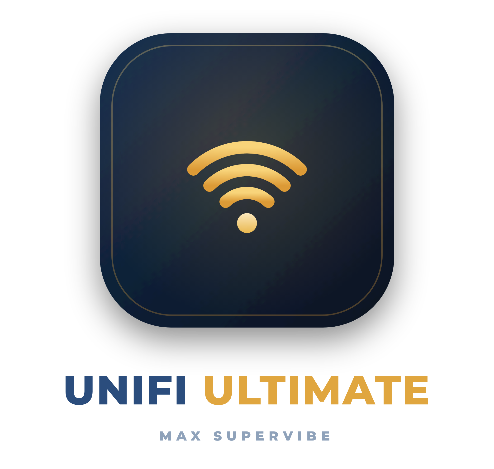
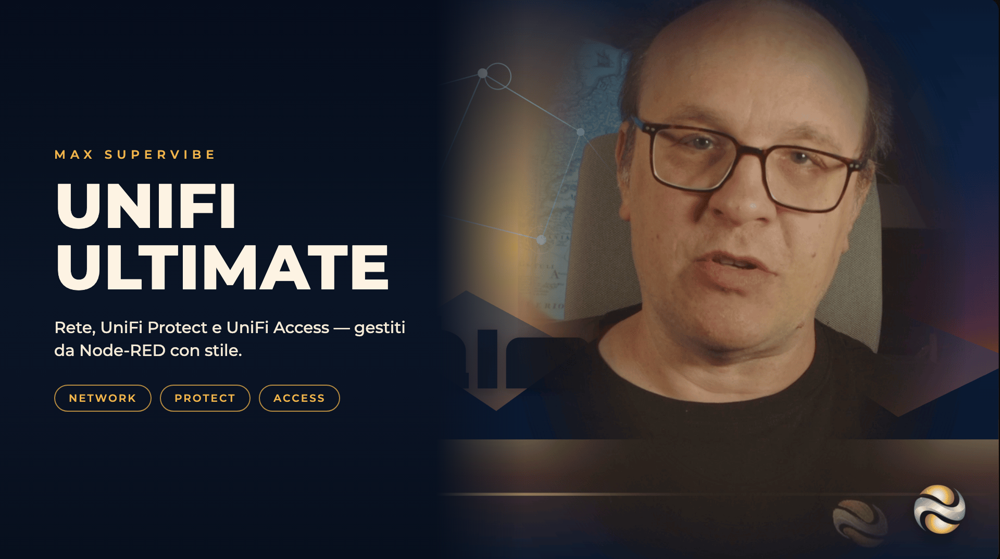

  

## The most italian Ubiquiti Unifi Nodes for Node-RED

Control and monitor your **UniFi Network**, **UniFi Protect**, and **UniFi Access** devices directly from Node-RED.
UniFi Ultimate brings the full power of the Ubiquiti UniFi ecosystem to Node-RED. Monitor and control UniFi Network, Protect, and Access using intuitive nodes, receive real-time events, manage devices, PoE ports, cameras, and client presence, and build powerful automation workflows without complex coding.

 
 
 

[![NPM version][npm-version-image]][npm-url]
[![Node.js version][node-version-image]][npm-url]
[![Node-RED Flow Library][flows-image]][flows-url]
[![Docs][docs-image]][docs-url]
[![NPM downloads per month][npm-downloads-month-image]][npm-url]
[![NPM downloads total][npm-downloads-total-image]][npm-url]
[![MIT License][license-image]][license-url]
[![Youtube][youtube-image]][youtube-url]

  

[View Changelog](CHANGELOG.md)

<a href="https://youtube.com/playlist?list=PL9Yh1bjbLAYrWKtMlopN0swuQXbdJ8MFJ&si=4MmW1nNTCLrJtEHv">
  Watch news and tutorials on YouTube
</a>

 
 

## Install

In Node-RED:

1. Open `Manage palette`.
2. Select `Install`.
3. Search for `node-red-contrib-unifi-ultimate`.
4. Install the package.

## Quick Start

1. Add a config node for your UniFi product: **Unifi Network Config**, **Unifi Protect Config**, or **Unifi Access Config**.
2. Enter your UniFi controller address and login credentials.
3. Add the matching node to your flow.
4. Select the device you want to control or monitor.
5. Select the action.
6. Click **Deploy**.
7. Send any message into the node to run the action.

> **Tip:** For most actions, the incoming message is just a trigger — the node uses the device and action you configured in the editor.  
> The only exception is **Clients Control** with a _controlled by msg.payload_ action: send `true` to enable (PoE or the port) and `false` to disable it, on every target in its list.

> **Custom port:** Each config node has an optional **Port** field. Leave it empty to use the default (`443` for Network/Protect, `12445` for Access). Set it when your controller listens on a custom port — for example a **UniFi OS server** that uses `11443`. A port written directly in the controller address (`host:port`) takes precedence over this field.

> **Self-signed certificates:** Each config node has an **Allow self-signed certificate** option, enabled by default. UniFi controllers almost always present a self-signed certificate, so keep it checked for UniFi OS / UXG setups. Uncheck it only if your controller uses a certificate signed by a trusted certificate authority and you want strict verification.

> **Optional local account:** Protect, Network, and Access config nodes include **Local User** and **Local Password**, stored in Node-RED's credential store. Protect uses this shared account for LPR text, recorded-event searches, and event images. Network Internet/WAN monitors use the local account when the controller rejects the API key on local endpoints. Access stores the fields but its actions, including door monitoring, use the API token. Leave both fields empty when they are not needed. The API key/token remains required. Protect history callers can still supply a complete per-request account to override the configured one.

### Guided setup and monitoring

Every connection has a **Verify Connection** button. It tests the values in the editor from the Node-RED host and explains reachability, certificate, authentication and permission failures. It also checks complete local credentials where used. The editor keeps inline notes minimal; detailed requirements and output examples are in the HTML help.

| Node / selection | New action or option | Result |
| --- | --- | --- |
| Protect / Camera | **Receive Events with Photo** | Detection in `msg.payload`, the exact event's recorded image in `msg.image`, MIME type in `msg.imageType`. |
| Protect / Camera | **Read Recent Detections** | Inject-triggered event array, filter by detection type and time window (default 24 hours), up to 100 results. |
| Protect / LPR, photos, history | **Known plates** | One `PLATE = friendly name` per line; LPR adds `msg.knownPlate` and optional `msg.plateName`, while photo/history rows include named `plates`. |
| Access / Door | **Door Open Too Long** | `doorOpenTooLong` after the threshold (default 120 seconds), followed by `doorClosed`. Requires a physical DPS and token permission `view:space`. |
| Network / UniFi Device | **Device Offline / Restored** | `deviceOffline` after a confirmed outage (default 60 seconds), then `deviceRestored`. |
| Network / Site | **Monitor Internet and WAN** | `internetOffline` / `internetRestored`, plus native `wanFailover`, `wanActive`, `wanInactive` where supported. |

All monitoring actions start on deploy, share polling on their connection (using the shortest interval for the same target) and emit one alert/recovery per transition. A controller error or unknown state goes to output 2 and resets the pending delay; it never becomes a fabricated device or Internet outage. Initial healthy state is silent. An initial open/offline state starts timing from observation, and monitoring restarts after redeploy. Polling adds up to one interval plus request time to detection. Plate names are ordinary flow settings and are included in exports; account credentials are kept in Node-RED's credential store.

Protect event photos/history require the configured local account and retained recordings. Photos are retrieved by exact event ID, with brief retries for delayed availability. The node does not substitute a current camera snapshot. History metadata in `msg.details.history` includes `from`, `to`, `hasMore`, `nextOffset` and `stoppedReason`; a search scans at most 1,000 source rows and reports incomplete or repeated-page results. The time window is recalculated for each trigger, including when using **History offset**.

Network Internet monitoring needs a UniFi gateway and local API support. It uses the controller's **WWW** health; one inactive WAN is not evidence of a total Internet outage. WAN transitions use native `EVT_GW_WANTransition` events for the selected site and identify the actual reported interface, without guessing which WAN is primary. The last 100 source events are checked per poll, so busy sites or long interruptions can leave gaps. Unsupported WAN event endpoints are reported separately while Internet health monitoring continues. These local APIs depend on controller version and permissions.

Import [guided monitoring examples](examples/unifi-guided-monitoring.json), select your connections and devices, then deploy. Each action is wired to result/error Debug nodes. See the HTML help for example messages and the details of each option.

 
 

  

Use **Network** nodes to work with:

- sites
- UniFi devices such as switches and access points
- connected clients such as phones, computers, and IoT devices
- switch ports and PoE control
- client presence detection

Things you can do:

- Check whether a device or phone is connected to your network.
- Track presence either by the exact UniFi client ID or by client name; name matching tolerates private/rotating MAC addresses by resolving the active client again on every poll.
- Re-send the current presence state at a fixed interval with the Presence node's **Resend** field (e.g. to keep a dashboard or home-automation system in sync).
- Count how many clients are currently online.
- List the site's configured networks, Wi-Fi broadcasts, and WAN interfaces.
- List VPN servers and site-to-site VPN tunnels.
- List existing guest Wi-Fi vouchers.
- Create guest Wi-Fi vouchers.
- Read CPU usage, memory, and uptime from a switch or access point.
- Read the temperature of a switch (where supported).
- Restart a UniFi device.
- Control a **list of clients/ports** at once with the **Clients Control** node: pick targets by switch+port or by client (its uplink switch/port is resolved automatically) and apply one action to all of them, getting a single summary message back.
- Switch PoE on/off or power-cycle it, and **enable/disable the whole switch port** (the UniFi _Port State_ toggle), driven by the editor or by `msg.payload`.
- Let **Clients Control** automatically find which switch port a client is connected to.
- Restart a whole list of switches/APs at once, or power-cycle all their active PoE ports, with the **Restart** node.
- Get notified when any client **joins or leaves a specific network** (for example your **Guest** network), including the device name — set the **Presence Detection** node's **Watch by** to **Network (join/leave)**.

 
 

  

Use **Protect** nodes to work with:

- cameras
- sensors (motion, contact, temperature, humidity, leak)
- lights
- chimes
- viewers
- bridges and Link Stations
- alarm hubs and key fobs
- sirens, relays, and speakers
- NVR

Things you can do:

- Receive motion, ring, contact, tamper, leak, and low-battery alerts.
- Read recognized license plates (LPR) from compatible cameras as text in `msg.payload`.
- Read the current state of a camera or sensor.
- Take a camera snapshot.
- Control PTZ cameras (move to preset, start/stop patrol).
- Display a custom message on a doorbell screen.
- Switch a viewer to a different live feed.
- Monitor bridges, Link Stations, alarm hubs, key fobs, sirens, relays, and speakers.
- Play or stop a siren, control relay outputs, and test speaker or siren sound.
- Read and select Protect Arm Profiles, then arm or disarm the local Alarm Manager from the NVR control.
- Poll Alarm Hub armed state or NVR local alarm status with **Read Alarm State**, or follow device updates with **Receive Events → Armed / Alarm status (local)**. These are separate alarm sources; the NVR arm commands require the local Alarm Manager. See [the polling example](examples/unifi-protect-alarm-state.json).

### Read license plates (LPR)

1. Enable license plate recognition on a compatible camera in UniFi Protect.
2. In the **PROTECT** node, select **Camera**, the camera, **Receive Events**, then **License Plate (LPR)**.
3. Open the shared **Protect connection** and enter its optional **Local User** and **Local Password** for a local UniFi OS account with permission to view that camera's recordings. Keep the API key configured there. The account is shared by every Protect node using that connection.
4. Deploy. Each recognized plate arrives as a string such as `"AB123CD"` in `msg.payload`, with `msg.eventName = "licensePlate"`.

`msg.details.lpr` contains the plate text, event ID, timestamps, and OCR confidence (0–100) when available. The original event is preserved in `msg.details.raw.event`. The first available text is emitted immediately, even at low confidence. Multiple plates are emitted separately; corrected text or a confidence increase produces another message. Identical readings and lower confidence for previously emitted text are suppressed. Every reading carries the plate string in `msg.payload`, including higher-confidence readings of unchanged text. `msg.details.lpr.isUpdate` is true for subsequent readings of the same event; confidence stays in `msg.details.lpr.confidence`. A later event with the same plate produces a new message. Startup, unrelated detections, and events without plate text produce no result; lookup failures go to the error output.

The [official Protect event schema](https://developer.ui.com/protect/v7.3.47/get-v1subscribeevents) exposes the `licensePlate` detection type but does not document the recognized text. The node therefore retrieves OCR metadata from the matching event through Protect's local, unofficial events API. An active LPR node prepares the configured account's session at deploy and reuses it until the controller requires renewal. OCR supplied in a live event bypasses pending lookups. The node starts looking for OCR at vehicle detection, before the live LPR classification arrives; vehicle detection alone never produces a plate. Up to five background follow-up reads, delayed by 150, 350, 750, 1500 and 3000 milliseconds between requests, retrieve missing text or refinements without holding the first reading. The first text still depends on when Protect exposes OCR, and later readings are not guaranteed accurate. This requires the local account above and may depend on the Protect version. Credentials use Node-RED's credential storage and are not included in messages or ordinary flow exports.

Importable example: [Protect LPR](examples/unifi-protect-lpr.json).

 
 

  

Use **Access** nodes to work with:

- doors
- Access devices (hubs, intercoms)
- door events (unlock, ring, DPS, emergency)
- lock rules and schedules
- visitors, access policies, holiday groups, and door groups
- recent system logs
- doorbell actions

Things you can do:

- Unlock a door remotely.
- Set a temporary unlock window with a custom duration.
- Enable lockdown or evacuation mode.
- Receive door events in real time.
- Trigger or cancel an intercom doorbell.
- Read visitors, access policies, schedules, holiday groups, and door groups.
- Inspect recent Access system-log entries and the door-group topology.

## Outputs

Every node has **two outputs**:

| Output         | When it fires                                                                |
| -------------- | ---------------------------------------------------------------------------- |
| **1 — result** | The action completed successfully. The result is available in `msg.payload`. |
| **2 — error**  | Something went wrong (connection problem, timeout, unsupported action).      |

When an error occurs, the node status turns red and the error message comes out of the second output. Connect it to a **debug** node to see what happened, or wire it to any notification logic in your flow.

**Startup and missing readings** — Protect, Access and Network device nodes have an advanced **Emit startup states and undefined payloads** checkbox, disabled by default, including for existing flows. With it disabled, initial state snapshots and missing, null or `undefined` readings are suppressed. Valid `false` and `0` readings still pass through. Enable the checkbox to allow startup snapshots and missing payloads. Protect observables never replay an old value when a fresh reading is unavailable; LPR and event-photo actions continue to emit only actual readings or photos.

**Repeat periodically** — for read actions, you can tick _Emit periodically_ in the node editor to have the node send the result automatically at a fixed interval, without needing an Inject node. The **Presence Detection** node offers a similar **Resend (s)** field: set it above `0` to re-emit the last known presence value on that cadence (even when unchanged). Resent messages carry `msg.eventName = "repeat"` so you can tell them apart from real state changes; leave it at `0` to disable.

## Example Flows

Import from `examples/`:

| Flow file                                                                                    | What it demonstrates                                     |
| -------------------------------------------------------------------------------------------- | -------------------------------------------------------- |
| [examples/unifi-protect-info.json](examples/unifi-protect-info.json)                         | Read the state of a Protect camera                       |
| [examples/unifi-protect-sensor-observe.json](examples/unifi-protect-sensor-observe.json)     | Receive sensor events (motion, temperature, humidity, …) |
| [examples/unifi-protect-camera-actions.json](examples/unifi-protect-camera-actions.json)     | Take snapshots, move PTZ, show doorbell messages         |
| [examples/unifi-access-door-control.json](examples/unifi-access-door-control.json)           | Door state, remote unlock, temporary lock rule           |
| [examples/unifi-access-intercom-doorbell.json](examples/unifi-access-intercom-doorbell.json) | Intercom — receive ring, trigger and cancel doorbell     |

## Notes

- You need valid login credentials for the UniFi application you want to use.
- Some actions are only available on specific device models.
- UniFi behavior can vary between application versions.

[npm-version-image]: https://img.shields.io/npm/v/node-red-contrib-unifi-ultimate.svg
[npm-url]: https://www.npmjs.com/package/node-red-contrib-unifi-ultimate
[node-version-image]: https://img.shields.io/node/v/node-red-contrib-unifi-ultimate.svg
[flows-image]: https://img.shields.io/badge/Node--RED-Flow%20Library-red
[flows-url]: https://flows.nodered.org/node/node-red-contrib-unifi-ultimate
[docs-image]: https://img.shields.io/badge/docs-documents-blue
[docs-url]: https://github.com/Supergiovane/node-red-contrib-unifi-ultimate#readme
[npm-downloads-month-image]: https://img.shields.io/npm/dm/node-red-contrib-unifi-ultimate.svg
[npm-downloads-total-image]: https://img.shields.io/npm/dt/node-red-contrib-unifi-ultimate.svg
[license-image]: https://img.shields.io/badge/license-MIT-green.svg
[license-url]: https://opensource.org/licenses/MIT
[youtube-image]: https://img.shields.io/badge/YouTube-Subscribe-red?logo=youtube&logoColor=white
[youtube-url]: https://youtube.com/playlist?list=PL9Yh1bjbLAYrWKtMlopN0swuQXbdJ8MFJ&si=4MmW1nNTCLrJtEHv
